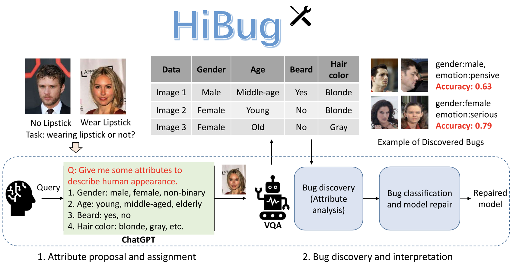

# HiBug
This repo is the implementation of [HiBug: On Human-Interpretable Model Debug](https://openreview.net/pdf?id=4sDHLxKb1L). HiBug is a data centric tool for investigating bugs in visual deep learning, such as rare cases in dataset, model's correlation on visual feature. 


## Features

- Utilizes large language models and vision-language models for bug discovery and repair.
- Provides a human-understandable debugging process.
- Equipped with a user interface.


## Installation

1. Clone the repository.
2. Set up the environment.
```
conda create -n HiBug python=3.7
conda activate HiBug
pip install -r requirements.txt
```

## Getting Started
1. Get a ChatGPT API key.
2. Follow the steps in run.ipynb.
    - Fill the empty list with selected attribute names.
    - Ensure that the data types match the code specifications.

## Example
We provide a use case on celebA dataset in [Code](celebA_use_case.ipynb)

## Citing

If you find this repository useful for your work, please consider citing it as follows:

```bibtex
@inproceedings{chen2023hibug,
  title={HiBug: On Human-Interpretable Model Debug},
  author={Chen, Muxi and Li, Yu and Xu, Qiang},
  booktitle={Thirty-seventh Conference on Neural Information Processing Systems},
  year={2023}
}
```